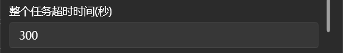
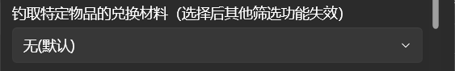
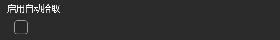
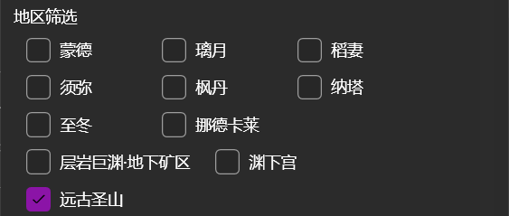
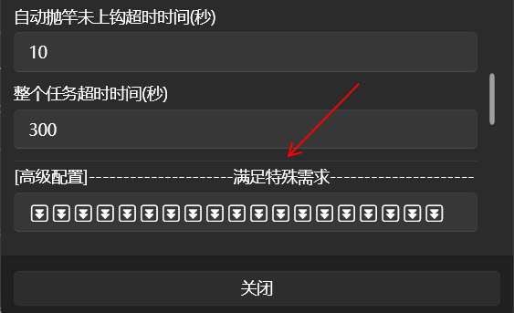

## 基本项目配置

每个JS脚本都是一个文件夹，文件夹内必须要有一个脚本描述文件 `manifest.json` 和一个入口程序文件 `*.js`。

脚本的配置可以通过一个 JSON 配置文件进行 UI 渲染，然后用户可以修改配置并执行脚本。

项目内所有文件编码必须是 `UTF-8` 。

### manifest.json

```json
{
  "manifest_version": 1,
  "name": "传送并自动秘境", // 名称
  "version": "1.0", // 版本
  "bgi_version": "0.36.1", // 适用于 BetterGI 的最低版本，BetterGI低于此版本会提示
  "description": "BetterGI自带脚本，用于传送后并执行自动秘境", // 描述
  // 作者信息
  "authors": [
    {
      "name": "huiyadanli",
      "link": "https://github.com/huiyadanli"
    }
  ],
  // 自定义配置
  "settings_ui": "settings.json",
  // 入口文件
  "main": "main.js",
  // 需要保留的文件路径（支持正则表达式与通配符）
  "saved_files": [
    "data/*.txt",
    "user_data.txt"
  ],
  //模块搜索路径，可以配置多个，不允许/字符开头
  "library": [
    ".",
    "src",
    "./module"
  ]
}
```

### main

```js
(async function () {
    // 所有的代码必须由 async function 包裹
})();
```

### library


- 支持js中使用ES6 Module语法导入其他模块，不支持CommonJS
- 语法参考：
  - **导入：** https://developer.mozilla.org/zh-CN/docs/Web/JavaScript/Reference/Statements/import
  - **导出：** https://developer.mozilla.org/zh-CN/docs/Web/JavaScript/Reference/Statements/export

 - 另外 
   - `import()` 在ClearScript中是实验性功能且在BGI中未开启，暂不支持动态导入。
   - `packages` 为工具类与公用资源文件目录，请勿将`packages`作为你的依赖文件目录。


#### 依赖引用与编写规范


仅针对`packages`（工具类与公用资源文件）进行以下说明：

##### 1、导入依赖

依赖引用时仅支持以下语法（ESM标准语法，不区分单引号与双引号）

```js
import { isInMainUI } from "../../../packages/utils/tool.js";
import paimon from "../../../packages/assets/imgs/paimon_menu.png";
```

##### 2、编写工具函数

工具类请在`packages/utils`目录下编写。  
引入的资源文件请务必使用`../assets/xxx`取上级资源目录。  
运行脚本时，BGI会自动将import的图片资源转为opencv的mat对象，将js与图片以外的资源转为普通文件。
```js
import paimon from "../assets/imgs/paimon_menu.png";
// 上面的import语句最终相当于 const paimon = file.ReadImageMatSync("packages/assets/imgs/paimon_menu.png");
import paimon_txt from "../assets/imgs/paimon_menu.txt";
// 上面的import语句最终相当于 const paimon_txt = file.ReadTextSync("packages/assets/imgs/paimon_menu.txt");

function isInMainUI() {
  const gameRegion = captureGameRegion();
  const ro = RecognitionObject.TemplateMatch(paimon, 0, 0, 1920, 1080);
  const result = gameRegion.find(ro);
  return result.isExist();
}

export { isInMainUI };
```

##### 3、导入脚本

由于依赖库`packages`不会通过ESM构建进行数摇优化，仓库提供了导入脚本`dev_deploy.js`，开发者可以通过运行此脚本将自己的脚本解析复制到BGI中。  
运行脚本前，请确保你拥有完整的仓库文件（git clone https://github.com/xxx/bettergi-scripts-list.git ），防止依赖库位置错误无法解析。  
运行脚本前，请确保你拥有本地`node.js`环境，这是独立运行js的必要条件。  
在根目录下，运行: 
```
  node build/dev_deploy.js <脚本文件夹名> <BGI目录>
  
  例：node build/dev_deploy.js test E:\BetterGIProject\BetterGI
```
脚本会被复制到你的BGI中，`packages`会被删除后重新导入，脚本其他文件会被覆盖导入（请确保没有数据文件，防止被覆盖），因此可能会有残留文件，需要手动清理。


### settings_ui

用于在 BetterGI 的调度器中配置变量

```js
[
  {
    "name": "selectValue", // 变量名，在js内使用 settings.变量名 获取对应的配置值
    "type": "select", // 类型
    "label": "选项框", // 显示标签
    "options": [ //选项
      "选项一",
      "选项二"
    ]
  },
  {
    "name": "inputValue",
    "type": "input-text",
    "label": "文本框"
  },
  {
    "name": "checkValue",
    "type": "checkbox",
    "label": "复选框"
  }
]
```

- **类型为```input-text```时**



```js
{
    "name": "exampleValueName",
    "type": "input-text",
    "label": "示例标签名",
	"default": "默认填充文本"
}
```
如果不含```default```键，则js的默认读取值为```undefined```

如果存在值，则值的类型为```String```

- **类型为```select```时**



```js
{
    "name": "exampleValueName",
    "type": "select",
    "label": "示例标签名",
    "options": [
      "选项一",
      "选项二"
    ],
	"default": "选项一"
}
```
如果不含```default```键，则js的默认读取值为```undefined```

```default```的值必须为```options```列表中的一项，否则js的默认读取值为```undefined```

如果存在值，则值的类型为```String```

- **类型为```checkbox```时**



```js
{
    "name": "exampleValueName",
    "type": "checkbox",
    "label": "示例标签名",
	"default": false
}
```
如果不含```default```键，则js的默认读取值为```false```

如果存在值，则值的类型为```boolean```

- **类型为```multi-checkbox```时**



```js
{
    "name": "exampleValueName",
    "type": "multi-checkbox",
    "label": "示例标签名",
	"options": [
      "选项一",
      "选项二",
	  "选项三"
    ],
	"default": [
      "选项一",
      "选项三"
    ]
}
```
无论是否存在选项被勾选，JS读取的值为C#的```List<string>```对象，需要使用```Array.from()```将其转换为适配JS的```object```

**注意：** 如果使用了```default```，则必须按照上述格式，即使仅设置一个默认项

附: [Array.from()使用方法示例](https://bettergi.com/dev/js/file.html#%E6%96%87%E4%BB%B6%E8%AF%BB%E5%8F%96%E4%B8%8E%E7%9B%AE%E5%BD%95%E7%9B%B8%E5%85%B3%E6%93%8D%E4%BD%9C%E7%BB%84%E5%90%88%E7%A4%BA%E4%BE%8B-%E5%AE%9E%E9%99%85%E5%BA%94%E7%94%A8) (对于以上代码框内的定义，前述语句的括号内填入settings.exampleValueName即可)

- **类型为```separator```时**



```js
{
    "type":"separator"
}
```
仅有以上一种用法，用作分隔符，为了在不同类别、目的的选项之间提供一个视觉上的缓冲
