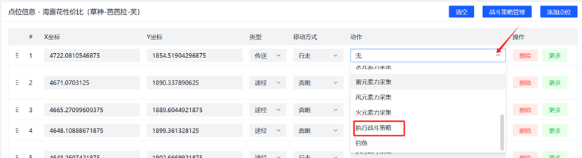
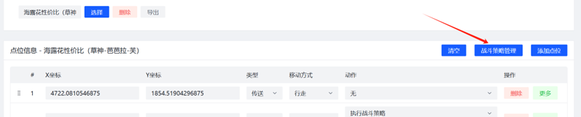
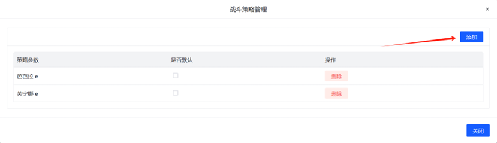
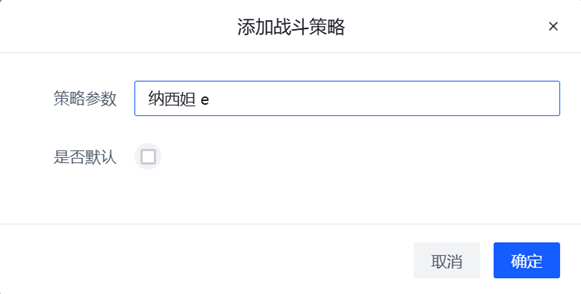
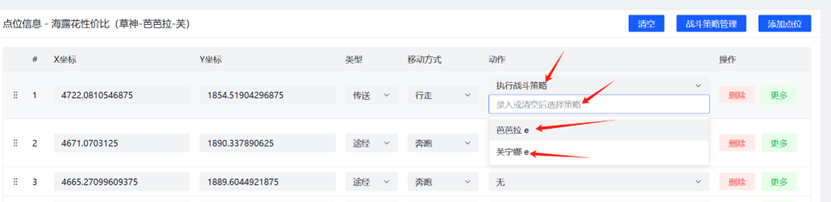
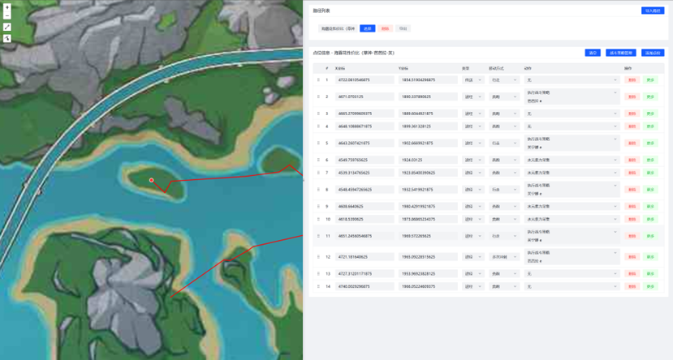

## 制作地图追踪任务

所有结果文件都保存在 `\User\AutoPathing` 目录下(无论是编辑器中导出还是不使用编辑器的情况下)。BetterGI界面内只会显示其中二级目录下的文件。

首先在录制前点击“打开录制编辑器”，然后去快捷键标签页绑定下面的快捷键，然后在游戏内使用。

1. **启动/停止路径记录器**：启动或停止记录过程。(未打开录制编辑器的情况下会直接保存文件)
2. **添加路径点**：在路径中添加一个记录点。具体记录点类型和一些配置需要手动修改。

录制完成后可以在编辑器中修改点位的各个属性，然后导出路径即可。

注意：

- 这个功能实际不会录制你的路径，只是在你按下快捷键时记录当前所在点位，你可以直接在录制编辑器中编辑，也可以手动修改点位文件。
- 如果要完成一个“下落攻击退出飞行状态”的动作，请在空中记录一次路径点，并在下落攻击落地后再记录一个路径点。并且修改空中点位的 `action` 。
- 请不要过于频繁地录制路径点(每个路径点不要太近)，相距较远的路径点会使用疾跑等方式快速接近并不断修正误差，频繁录制将导致视角震荡等问题。
- **录制完成后一定要进行测试！有些时候小地图识别失败会返回一个固定坐标的路径点！**
- 🗺️ 录制编辑器也提供了在线版：[https://bgi-map.huiyadan.com/](https://bgi-map.huiyadan.com/)

## 地图追踪文件格式

文件示例：

```json
{
  "info": {
    "name": "示例名称",
    "type": "collect"
  },
  "positions": [
    {
      "action": "",
      "move_mode": "walk",
      "type": "teleport",
      "x": 3397.591796875001,
      "y": -1174.529296875
    },
    {
      "action": "",
      "move_mode": "fly",
      "type": "path",
      "x": 3376.546386718751,
      "y": -1133.45263671875
    },
    {
      "action": "stop_flying",
      "move_mode": "fly",
      "type": "path",
      "x": 3366.349609375001,
      "y": -1111.7900390625
    },
    {
      "action": "",
      "move_mode": "walk",
      "type": "target",
      "x": 3346.599609375001,
      "y": -1085.44873046875
    }
  ]
}
```

解释：

- `info` 对象包含了基础信息(当前除了展示没啥用)

| 字段名      | 描述   | 详细信息                          |
|----------|------|-------------------------------|
| `name`   | 名称   | 建议和文件名一致                      |
| `type`   | 路径类型 | 当前此字段除了展示无作用 <br>`collect`：采集 |
| `author` | 作者   | 作者信息                          |

- `positions` 数组包含了一系列的对象，每个对象代表一个游戏内位置和相关的动作信息。

| 字段名             | 描述   | 详细信息                                                                                                                |
|-----------------|------|---------------------------------------------------------------------------------------------------------------------|
| `x`             | X 坐标 | 原神游戏内坐标系下的X坐标                                                                                                       |
| `y`             | Y 坐标 | 原神游戏内坐标系下的Y坐标                                                                                                       |
| `type`          | 点位类型 | `teleport`：传送点，会触发自动传送操作 <br>`path`：途经点，粗略路过的点位 <br>`target`：目标点，精准经过的点位 <br>`orientation`：朝向点，只会朝向对应点位             |
| `move_mode`     | 移动模式 | `walk`： 普通的行走模式，较远时会偶尔冲刺 <br> `fly`：不停的跳跃直到起飞 <br> `climb`：不会因为长时间在一个点导致触发自动避障 <br> `run`：持续奔跑 <br> `dash`：消耗体力快速冲刺 |
| `action`        | 动作   | 表示在该位置执行的动作，和移动相关的动作，都会在精确到达点位后执行。具体见下表                                                                             |
| `action_params` | 动作参数 | 与动作配合使用，具体什么时候使用见下表                                                                                                 |

- `action` 可以有的值

| `action`值           | 描述                                                                                                                                                                  |
|---------------------|---------------------------------------------------------------------------------------------------------------------------------------------------------------------|
| `stop_flying`       | 下落攻击，停止飞行，`move_mode = fly`的情况才有效。                                                                                                                                  |
| `force_tp`          | 强制以当前的x,y坐标进行自动传送，`type = teleport`的情况才有效。                                                                                                                          |
| `nahida_collect`    | 使用纳西妲长按E技能进行收集。                                                                                                                                                     |
| `pick_around`       | 在点位周围转圈移动，适合拾取等场景。`action_params` 可以填写数字，代表圈数，圈数越大拾取的范围也越大，不填默认为1                                                                                                   |
| `hydro_collect`     | 使用水元素力收集(合并到元素力采集)。[查看支持角色](https://github.com/babalae/better-genshin-impact/blob/main/BetterGenshinImpact/GameTask/AutoPathing/Handler/ElementalCollectHandler.cs) |
| `electro_collect`   | 使用雷元素力收集(合并到元素力采集)。[查看支持角色](https://github.com/babalae/better-genshin-impact/blob/main/BetterGenshinImpact/GameTask/AutoPathing/Handler/ElementalCollectHandler.cs) |
| `anemo_collect`     | 使用风元素力收集(合并到元素力采集)。[查看支持角色](https://github.com/babalae/better-genshin-impact/blob/main/BetterGenshinImpact/GameTask/AutoPathing/Handler/ElementalCollectHandler.cs) |
| `pyro_collect`      | 使用火元素力收集(合并到元素力采集)。[查看支持角色](https://github.com/babalae/better-genshin-impact/blob/main/BetterGenshinImpact/GameTask/AutoPathing/Handler/ElementalCollectHandler.cs) |
| `up_down_grab_leaf` | 上下移动视角按T前往四叶印。该动作将忽略所有移动方式和点位类型，强行把点位视作朝向点，四叶印操作会在完成朝向动作之后执行，并只基于飞行图标出现检测是否完成四叶印动作。(0.44后重置)。                                                                                                                                            |
| `fight`             | 在此处直接执行自动战斗(0.36.4更新了结束方式)，此 `action` 的点位一定会按照`path`类型的点位进行执行。                                                                                                      |
| `combat_script`     | 可以直接执行[战斗策略脚本](/feats/task/domain.html#战斗策略脚本编写)，策略脚本需要填写在 `action_params` 中。<br>当策略不指定角色名时，会直接使用当前角色执行策略脚本。<br>请注意活用战斗策略的特性：不存在队伍中的角色对应的策略也不会执行(0.36.4新增)。         |
| `log_output`        | 在遮罩窗口输出INF级别的日志。`action_params`中填写预期的日志输出。注：在移动到目标点之前输出日志，`type = teleport` 时不支持此action。(0.40.0新增)                                                                  |           
| `fishing`           | 执行钓鱼(0.43.0存在)                                                                                                                                                      |           |
| `set_time`          |  设置时间。`action_params`中填写格式：`HH:MM` 或 `HH:MM:<bool>`，bool值可以指定是否使用快速调整时间，默认是 `true`，如 `06:00:true` 表示使用快速调整时间的方式调整时间到早上六点(0.44.0存在)|
| `use_gadget`        |  使用小道具(<kbd>Z</kbd>)，默认会等待CD。`action_params` 填写 not_wait 则不等待，直接使用小道具 |


## 编辑器中自定义战斗策略的教程

以下是在地图路径点编辑器中使用自定义战斗策略的教程。这个小教程的作者：`彩虹QQ人`

### 1.将该点动作设置成战斗策略

选中该点-动作下拉窗口-选择“执行战斗策略”。



### 2.在添加战斗策略

在战斗策略管理中，增加所需要的战斗策略，点击“战斗策略管理”跳转到图6。



点击“添加”。




在“策略参数”一栏中填写所需的战斗策略，具体策略编辑请参照：[自动秘境 | BetterGI·更好的原神](https://bettergi.com/feats/task/domain.html#战斗策略脚本编写)



### 3.使用自定义战斗策略

添加完成战斗策略之后，在“执行战斗策略”选项中，会有输入框和下拉框，可以选择在此处重新输入特殊的战斗策略，也可以选择一些自定义的通用战斗策略。

建议：在“添加战斗策略中”的操作中，录入通用的一些战斗策略(如芙宁娜重击、万叶长E等)。一些特殊的战斗策略或是比较复杂、使用频率不高的，则建议在“执行战斗策略”下面的输入框中填写。



### 4.最终路线录制呈现



以上就是在地图追踪功能中使用自定义的战斗策略教程，希望对正在看此教程的你有所帮助。

最后，祝自己十连双金，单抽奇迹。

## 附录

全地图传送点坐标合集，如果传送位置不对可以对照这个图看下。(最高到5.0版本，且和当前软件内置的传送点合集有区别)

[https://wwmy.lanzouq.com/b0fosbd9g](https://wwmy.lanzouq.com/b0fosbd9g) 密码:coco


