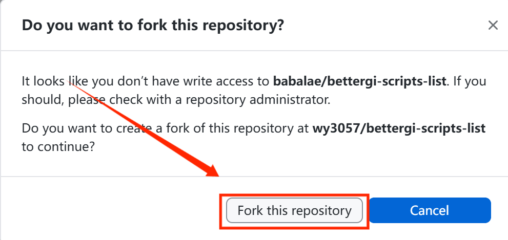

# 如何提交你的脚本？
当你做完新的脚本并想发布给其他用户使用，请往下看喵
谁都能看懂的 GitHub Pull Request 使用指南 (\*´▽ ｀)ノノ
用于BGI中央仓库提交你的脚本，并提交给 BGI 的开发者进行审核，合并到 BGI脚本 的主仓库中。

::: warning
本教程中对很多概念进行了简化，为了让更多朋友能实际用起来，甚至有一些很不优雅~~但是简单~~的操作，还有一些不那么正确的解释，还请大佬们轻喷。
若您有一定的 git 使用经验及编程基础，~~那你还看个 🔨~~，可以看稍微进阶一点的教程(暂时没有，等等吧）  
:::  

本文部分内容直接根据 [MAA网页端PR教程](https://maa.plus/docs/zh-cn/develop/pr-tutorial.html) 修改而成，感恩！

**当你成功提交脚本时，就可以加入脚本开发者的大家庭啦。**
BetterGI脚本作者群（BetterGI内的脚本制作者可以进群,进群时需要在进群理由**附上github主页链接**，方便审核） 
[764972801](https://qm.qq.com/q/wqgZhBJcPK) 

## 基本概念及名词解释

这一章节内容略微枯燥，不感兴趣可以直接跳过到下面实操部分，有不理解的再回来看

### Repository（仓库）

简称 repo，存放我们代码及其他资源文件的地方

👇 可以简单理解为当前这个网页及里面所有的内容，就是 BGI脚本 的仓库（我们一般称之为BGI脚本的中央仓库）

### Fork（复制）

复制，字面意思，将 BGI 的代码复制一份，然后可以进行后续修改等等的操作，避免把原来的弄坏了

但一般说中文“复制”我们可能首先想到的是 copy 的意思，fork 也没有其他明确的翻译，所以我们一般习惯直接说英文，比如“把代码 fork 一份走”

既然是复制后的，那就是 `BGI (1)`（bushi）

为了和原本的仓库区分开，所以我们一般将原本的 BGI脚本 仓库称为 “主仓库”、“upstream（上游仓库）”

因为每个人都可以自己复制一份走，所以复制后的称之为“个人仓库”，“origin（原仓库）”，这是fork到自己仓库后的页面

### Pull Request（拉取请求、合并请求）

简称 PR，“拉取请求”这个太直译了，听起来很奇怪，~~而且字太多了打起来太累~~，所以也是一样的大家一般就直接说：“来个 PR”

书接上文，你 fork（复制）的个人仓库，修改完了，怎么把内容提供给主仓库呢？这时候我们就可以开一个 PR，申请将自己修改的内容加入到主仓库中。

当然啦，既然是“请求”，那自然是需要审批的，BGI脚本 Team 的各位可能会针对你的修改提一些意见等，当然我们的意见也不一定完全正确，大家合理讨论~

👇 下面的是 PR页面

### Conflict（冲突）

假设一下，主仓库中有个 A 文件，它的内容是 111

你 fork 了一份，将其内容改成了 222，但是你刚准备提交 PR，这时候张三也 fork 了一份并提交了 PR，并将 A 文件改成了 333

这时候我们就会看到，你俩都修改了 A 文件，并且修改的不同，那听谁的好呢？这就是 Conflict（冲突）

冲突解决起来比较麻烦，这里仅阐述概念，方便实际遇到时能理解发生了什么，暂不阐述解决方案

**本文档提供两个提交教程，请按需选择。该教程默认*拥有上网能力和github账号***

# 方案一：GitHub Desktop提交教程
::: warning
本教程仅适用于接受下载软件的朋友，若您不想下载软件，建议直接使用 方案二 进行操作。  
:::

## 第一步：下载GitHub Desktop  
首先确保网络通畅，前往[下载地址](https://desktop.github.com/download/)下载GitHub Desktop    
1. 点击下载按钮，下载软件，在下载中打开软件安装包。

2. 运行安装程序，按照提示完成安装，并且登录你的github账号

## 第二步：克隆 BGI脚本中央仓库 
1. 当第一次打开github desktop时，点击“Clone a repository from the Internet”按钮

2. 选择url，并将仓库地址复制到输入框中，最后点击clone，等待下载完成。  
仓库地址`https://github.com/babalae/bettergi-scripts-list.git`

## 第三步：添加新的分支
1. 点击“Current branch”按钮，点击“New branch”按钮

2. 输入分支名称，建议使用英文，分支名称可以是你脚本的名称或者其他有意义的名称，点击Create Branch按钮

## 第四步：添加你的脚本
1. 在左侧的仓库列表中，选择刚刚克隆的仓库，点击“Show in Explorer”按钮，打开文件夹。

2. 你现在来到了仓库目录，选择repo文件夹，进入repo文件夹，然后看见四个文件夹，请注意**阅读注意事项**。

::: warning 特别注意
你所提交的脚本文件必须符合相应的类型

`combat` 代表战斗脚本

`js` 代表js脚本

`pathing` 代表地图追踪

`tcg` 代表七圣召唤脚本

如果脚本文件类型确认完毕，请继续往下阅读
:::

3. 现在将你所需要提交的脚本**拖入相应文件夹中**，关于脚本命名规则和目录结构，请看[脚本提交规范](https://github.com/babalae/bettergi-scripts-list/blob/main/README.md)  
4. 当你的文件正确加入文件夹时候，软件左侧出现相应的改动如下图(图示仅为测试文件)

5. 填写提交所需的描述，并点击 Commit to main，如图。

6. 点击“Publish branch”按钮，发布分支。点击“Fork this  repository”按钮。

7. 选择to contribute to the parent  project，点击continue。

8. 选择publish branch

## 第五步：创建 PR
1. 点击preview your pull request按钮，进入PR页面。之后点击Create pull request按钮，创建PR。

2. 在 PR 页面，填写 PR 的标题和描述，然后点击 Create Pull Request，提交你的 PR。

3. 若提交成功了，会跳转到一个 PR 页面，此时你的脚本被提交到主仓库供审核。

## 第六步：修改 等待合并
1. 等大佬们审批通过，pr页面出现紫色的Merged，就全部完成了，你修改的内容已经进入 BGI脚本 中央仓库啦！
   
2. 下次如果还想提别的 PR，请先回到你的个人仓库的主页，点击 Sync fork，让你的仓库和主仓库同步。
   这里注意啦，如果有一个红色的 Discard 1 commit，那就点红色的这个；如果没有，再点绿色的 Update branch。
   接下来就可以重复4的步骤再次修改啦
   
### 还有第二个文件要改的？改完了发现弄错了想再改改？都没关系！
 _重复第四步的1-5即可！当你的pr尚未被合并时，这些改动会自动添加到你的 PR 中。_

# 方案二：纯网页端 PR 教程

网页端直接根据 [MAA网页端PR教程](https://maa.plus/docs/zh-cn/develop/pr-tutorial.html) 修改而成，感恩！

## 纯网页端 PR 操作全流程

1. 👇 首先进入BGI脚本主仓库，点右上角这个按钮 Fork 一份代码  
   [BGI中央仓库](https://github.com/babalae/bettergi-scripts-list)

2. 然后直接点击 Create Fork  
3. 稍等片刻，接下来来到了你的个人仓库，可以看到标题是 “你的github名字/bettergi-scripts-list”，下面一行小字 forked from babalae/bettergi-scripts-list （复制自 BGI脚本 主仓库）

4. 现在可以愉快的提交你的脚本了

::: warning 特别注意
你所提交的脚本文件必须符合相应的类型

`combat` 代表战斗脚本

`js` 代表js脚本

`pathing` 代表地图追踪

`tcg` 代表七圣召唤脚本

如果脚本文件类型确认完毕，请继续往下阅读
:::

* （1）.点击你 fork 的仓库中的repo文件夹，根据你所需要的提交的文件，选择相应的文件夹。
* （2）.此处以提交战斗脚本为例，点击combat文件夹，点击Add file -> Upload files，将你的脚本文件上传到combat文件夹中。
  
  
* (3).点击choose your files，选择你的脚本文件，点击 Commit changes，提交你的脚本文件。提交完成后，会跳转到一个仓库页面。
  
* (4).此时点击Contribute，再点 Open Pull Request，进入到 PR 页面。
  
* (5).在 PR 页面，填写 PR 的标题和描述，然后点击 Create Pull Request，提交你的 PR。
  
* (6).若提交成功了，会跳转到一个 PR 页面，此时你的脚本被提交到主仓库供审核。
  

5. 还有第二个文件要改的？改完了发现弄错了想再改改？都没关系！重复步骤 4. 中的1-6即可！
   你也可以删除你所提交的pr
   点击 Close pull request，关闭 PR即可。
   
6. 如果大佬们说要再修改一些小问题的话，回到 **你的个人仓库**，修改文件即可！
   注意不需要操作步骤 1-2（重新 fork）和步骤4的全部内容（重新 Pull Request），你当前的 Pull Request 仍处于待审核状态，后续的修改会直接进入到这个 Pull Request 中
7. 等大佬们审批通过，pr页面出现紫色的Merged，就全部完成了，你修改的内容已经进入 BGI脚本 中央仓库啦！
   
8. 下次如果还想提别的 PR，请先回到你的个人仓库的主页，点击 Sync fork，让你的仓库和主仓库同步。
   这里注意啦，如果有一个红色的 Discard 1 commit，那就点红色的这个；如果没有，再点绿色的 Update branch。
   接下来就可以重复4的步骤再次修改啦
   
   
在**脚本发布后**，你的 GitHub 头像将会自动进入到贡献者列表名单中，非常感谢各位的无私奉献！

::: tip 贡献/参与者
感谢所有参与到脚本开发中的朋友们，是大家的帮助让BGI越来越好！ (\*´▽ ｀)ノノ

:::

