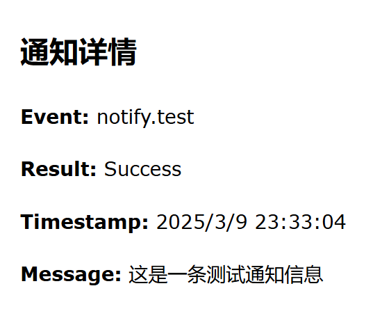
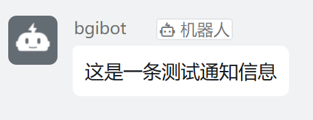

用于 JavaScript 脚本的通知API请[前往对应页面查看](/dev/js/notification.html)

## 支持通知方式

* Webhook 通知
* Windows 通知（注意：通知框可能会造成原神无法获取焦点）
* 飞书通知
* 邮件通知
* websocket通知
* dingding通知
* telegram通知
* 企业微信通知
* Bark通知
* xxtui通知  
*更多通知即将适配中......*

## Webhook 请求体

示例：

```json
{
  "event": "domain.end",
  "result": "Success",
  "timestamp": "2025-02-01 12:34:56",
  "screenshot": "base64EncodedImageString",
  "message": "自动秘境结束",
  "send_to": "userid"
}
```
(send_to功能用于给指定人发送信息，目前只有webhook支持，其他通知不包含此功能)  
## 事件列表

* `notify.test` : 测试通知
* `domain.reward` : 自动秘境奖励
* `domain.start` : 自动秘境启动
* `domain.end` : 自动秘境结束
* `domain.retry` : 自动秘境重试
* `task.cancel` : 任务启动
* `task.error` : 任务错误
* `group.start` : 配置组启动
* `group.end` : 配置组结束
* `dragon.start` : 一条龙启动
* `dragon.end` : 一条龙结束
* `tcg.start` : 七圣召唤启动
* `tcg.end` : 七圣召唤结束
* `album.start` : 自动音游专辑启动
* `album.end` : 自动音游专辑结束
* `album.error` : 自动音游专辑错误

## QQ机器人接入webhook示例
底下是关于如何实现QQ机器人接入  
该插件是基于nonebot的插件，可以通过webhook的方式接入QQ机器人，这个代码是参考代码，希望对接入其他qq机器人~~有帮助~~  
贡献这个代码的作者水平很臭，多多谅解  
示例：  

```python
from typing import Union, Optional, List
from fastapi import FastAPI, status, HTTPException
from pydantic import BaseModel, Field, validator, root_validator
from nonebot import get_plugin_config, get_bot, get_driver
from nonebot.log import logger
from nonebot.drivers import ReverseDriver
from nonebot.plugin import PluginMetadata

from .config import Config

__plugin_meta__ = PluginMetadata(
    name='推送钩子',
    description='实现消息推送自由',
    usage='详见项目 README.md'
)

driver = get_driver()
config = get_plugin_config(Config)

# 确保 config 是 Config 类的实例
if isinstance(config, str):
    logger.error(f"Config is a string: {config}")
    try:
        config = Config.parse_raw(config)
    except Exception as e:
        logger.error(f"Failed to parse config: {e}")
        raise TypeError(f"Failed to parse config: {e}")

if not isinstance(config, Config):
    logger.error(f"Expected Config instance, got {type(config)}")
    raise TypeError(f"Expected Config instance, got {type(config)}")

if not isinstance(driver, ReverseDriver) or not isinstance(driver.server_app, FastAPI):
    raise NotImplementedError('Only FastAPI reverse driver is supported.')

ID = Union[str, int]

class Report(BaseModel):
    token: Optional[str] = Field(None, exclude=True)
    title: Optional[str] = None
    content: Optional[str] = None
    send_from: Optional[ID] = None
    send_to: Optional[List[ID]] = None
    send_to_group: Optional[List[ID]] = None
    event: Optional[str] = None
    result: Optional[str] = None
    timestamp: Optional[str] = None
    screenshot: Optional[str] = None
    message: Optional[str] = None

    @root_validator(pre=True)
    def _aliases(cls, v):
        if v.get('send_from') is None:
            v['send_from'] = v.get('from')
        if v.get('send_to') is None:
            v['send_to'] = v.get('to')
        if v.get('send_to_group') is None:
            v['send_to_group'] = v.get('to_group')
        return v

    def _validate(cls, v):
        if v is None or isinstance(v, list):
            return v
        else:
            return [v]

    _v_st = validator('send_to', pre=True, allow_reuse=True)(_validate)
    _v_stg = validator('send_to_group', pre=True, allow_reuse=True)(_validate)

app = FastAPI()

@app.post(config.report_route, status_code=200)
async def push(r: Report):
    logger.debug(f'Received report: {r.json()}')
    if config.report_token is not None \
    and r.token != config.report_token:
        logger.warning(f'Invalid token: {r.token}')
        raise HTTPException(status.HTTP_403_FORBIDDEN)

    # 使用新的message字段作为消息内容
    msg = r.message or config.report_template.format(
        title=r.title or '',
        content=r.content or '',
        event=r.event or '',
        result=r.result or '',
        timestamp=r.timestamp or '',
        message=r.message or ''
    )
    try:
        bot = get_bot(r.send_from or config.report_from)
    except KeyError:
        logger.warning(f'No bot with specific id: {r.send_from}')
        return
    except ValueError:
        logger.warning('No bot available or driver not initialized')
        return

    if r.send_to is None:
        if r.send_to_group is None:
            uids = config.superusers
        else:
            uids = []
    else:
        uids = r.send_to

    for uid in uids:
        logger.debug(f'Sending message to user {uid}')
        await bot.send_msg(user_id=uid, message=msg, message_type='private')

    if r.send_to_group is None:
        gids = []
    else:
        gids = r.send_to_group

    for gid in gids:
        logger.debug(f'Sending message to group {gid}')
        await bot.send_msg(group_id=gid, message=msg, message_type='group')

    logger.info(
        f'Report pushed: {r.json()}'
    )

@driver.on_startup
async def startup():
    if not config.report_token and config.environment == 'prod':
        logger.warning('You are in production environment without setting a token')

    driver.server_app.mount('/', app)
    logger.info(f'Mounted to {config.report_route}')

```

config
```python
from typing import Optional, List, Union
from pydantic import BaseModel, Extra

# 定义一个可以是字符串或整数的ID类型
ID = Union[str, int]

# Config类继承自BaseModel，用于配置报告系统的设置
# extra=Extra.ignore表示忽略额外的属性
class Config(BaseModel, extra=Extra.ignore):
    report_token: Optional[str] = None
    report_from: Optional[ID] = None
    report_route: str = '/report'
    report_template: str = '{title}\n{content}\nEvent: {event}\nResult: {result}\nTimestamp: {timestamp}\nScreenshot: {screenshot}\nMessage: {message}'
    environment: str
    superusers: List[str]

```  
对于这个插件，监听的一般为你的机器人部署地址加上`/report`即可，当你的webhook发送请求时，会自动推送消息到你的qq机器人。  
`sendto`可以指定发送的对象，`sendto_group`可以指定发送的群组，如果`sendto`和`sendto_group`都为空，则默认发送给所有`superuser`。
目前bgi暂不支持群组消息发送，所以`sendto_group`暂时无效。  
以上均基于nonebot开发，如果你使用的是其他框架，可以参考这个代码进行修改。  
**关于机器人推送多说的几点**  
1. bgi同时支持`websocket`推送，支持`websocket`连接的机器人也可以使用`ws`进行插件开发，但是需要注意的是，`websocket`推送的消息不支持指定用户发送，如果你对指定用户有刚需，请在插件加入对应模块实现指定用户推送功能。
2. 关于个人使用机器人进行消息推送，建议本地直接部署机器人，无需公网部署。地址直接填写`127.0.0.1`即可，然后使用`ws`或者`webhook`进行连接。目前比较简单粗暴的方式为`nonebot+onebotv11
+上述插件`即可实现  
3. 关于`websocket`链接目前采取的方式为发送一次消息即关闭链接，bgi目前不提供`websocket`长连接，理由是bgi目前而言没有短时间发送大量消息的需求，心跳消息没有存在的必要。~~还有可能出现奇奇怪怪的bug~~
## 邮件通知配置教程
底下以qq邮箱为例，如何配置邮箱通知，这些内容不会上传云端，请放心填写。  

在配置邮箱通知前，首先你需要了解并获得如下内容：  
* `SMTP服务器地址` : qq邮箱为smtp.qq.com
* `SMTP服务器端口` : qq邮箱为587
* `SMTP用户名` : 你的qq邮箱地址
* `SMTP密码` : qq邮箱的授权码——关于如何获得授权码请访问[这里](https://service.mail.qq.com/detail/0/75)
* `发件人邮箱` : 你的qq邮箱地址
* `发件人姓名` : 这个随意
* `收件人邮箱` : 你需要接受通知的邮箱地址
当你获得这些内容后，就可以在设置中填写这些内容了。  
配置完毕后发送测试通知，当邮箱接收到通知时，说明配置成功。  
测试通知示例如下:  
  

## 钉钉通知配置教程
钉钉通知也是通过webhook进行连接的，首先你需要了解并获得如下内容：  
* `webhookurl`：钉钉机器人的webhook地址，可以在钉钉群中添加机器人后获得  
* `secret`：钉钉机器人的secret，可以在钉钉群中添加机器人后获得  
具体获得webhookurl和secret的方法请参考官方文档  

[获得webhookurl](https://open.dingtalk.com/document/orgapp/custom-bot-to-send-group-chat-messages)  
[获得secret](https://open.dingtalk.com/document/orgapp/customize-robot-security-settings)

secret就是钉钉安全选项中的加签密钥，填写在设置中即可。

**注意！！在选择加密方式时候只需要选择加签即可，不需要选择其他任何选项！否则会导致通知失败！**  
配置完毕后发送测试通知，当钉钉群中收到通知时，说明配置成功。  
测试通知示例如下:  


