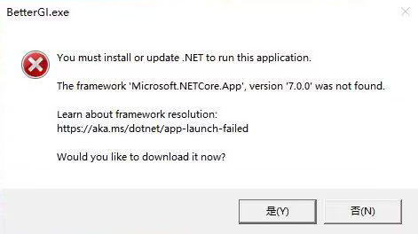

### ❓启动软件提示安装.NET 7 运行时？

提示如图：

请根据提示安装，否则无法启动软件。

没有提示，也进不去？手动安装下载：[.NET 7 运行时](https://dotnet.microsoft.com/zh-cn/download/dotnet/latest/runtime)

### ❓使用自动拾取的时候能看到拾取的日志，但是没有按F键拾取？
模拟操作部分可能被部分安全软件拦截，请加入白名单！已知 360安全卫士、提高了拦截强度的 WindowsDefender 会拦截部分类型的模拟点击。

### ❓自动拾取可以使用，为什么自动剧情没反应？
游戏内的自动剧情功能打开时，BetterGI 的自动剧情才会启用。也就是游戏左上角的“自动”按钮处于“播放中”状态。

### ❓为什么需要管理员权限？
因为游戏是以管理员权限启动的，软件不以管理员权限启动的话没有权限模拟鼠标点击。

### ❓会不会封号？
理论上不会被封。 **BetterGI 不会做出任何修改游戏文件、读写游戏内存等任何危害游戏本体的行为，单纯依靠视觉算法和模拟操作实现。** 但是mhy是自由的，用户条款上明确说明第三方软件/模拟操作是封号理由之一。当前方案还是存在被检测的可能。只能说请低调使用，请不要跳脸官方。
