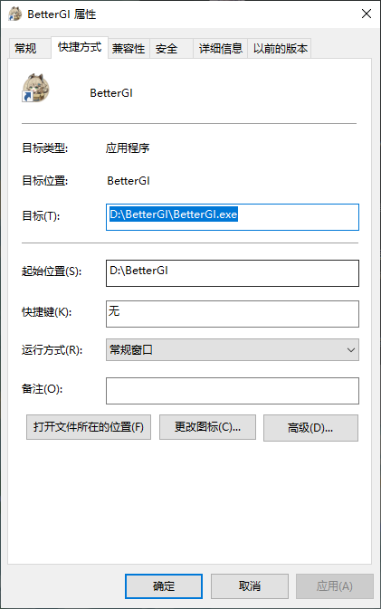

在使用过程中，难免会遇到需要修改或打开本地文件的情况，本部分内容将为你讲解BetterGI常用本地文件的位置与作用。

## 📂 目录结构概览

常用文件结构如下：
```
 📁 BetterGI  
  ├─ 📁 Assets  
  │   ├─ 📁 Config  
  │   ├─ 📁 Map  
  │   ├─ 📁 Model  
  │   └─ 📁 Web  
  │  
  ├─ 📁 log  
  │   ├─ 📄 better-genshin-impact20250908.log  
  │   ├─ 📄 better-genshin-impact20250909.log  
  │   └─ 📄 ... (超过21天自动删除)  
  │  
  ├─ 📁 Repos  
  │   ├─ 📁 bettergi-scripts-list-git  
  │   └─ 📄 repo_updated.json  
  │  
  └─ 📁 User  
      ├─ 📁 AutoFight  
      │   └─ 📄 *.txt  
      │
      ├─ 📁 AutoGeniusInvokation  
      │   └─ 📄 *.txt  
      │
      ├─ 📁 AutoPathing  
      │   └─ 📁 路径文件夹  
      │
      ├─ 📁 JsScript  
      │   └─ 📁 脚本文件夹  
      │
      ├─ 📁 KeyMouseScript  
      │   └─ 📄 *.json  
      │
      ├─ 📁 OneDragon  
      │   └─ 📄 默认配置.json  
      │
      ├─ 📁 ScriptGroup  
      │   └─ 📄 自定义调度器.json  
      │
      ├─ 📄 avatar_macro.json  
      ├─ 📄 config.json  
      ├─ 📄 pick_black_lists.json  
      └─ 📄 pick_white_lists.json  
```

下文将对这个目录结构中较重要的部分进行讲解。

---

## 🎯 核心文件夹详解

### 1. 🏠 BetterGI
这个文件夹是你的BetterGI安装目录即本地存储文件夹，具体位置根据你的安装位置决定。如果你不记得你装在哪儿了，可以右键你桌面的快捷打开方式图标，选择`属性`，查看里面的起始位置。 

如图，`目标`就是你实际打开的BetterGI程序，`起始位置`就是你的BetterGI文件夹所在位置。  



有的用户这里的目录是`BetterGI/BetterGI/xxx`，有的则是`BetterGI/xxx`，这并不会影响你的使用，不同的目录的产生原因是安装方式不同所致。  

**下文所提及的所有文件夹都位于该目录下。**

### 2. 🎨 Assets
这个文件夹是BetterGI的本体所使用的资源文件夹，里面存放的主要为模型、地图、编辑器、仓库页面等资源文件。

> 💡 **提示**  
> 一般用户日常用不到修改这些文件，喜欢动手的技术玩家可以尝试自己修改。

### 3. 📋 log
当你在社区提问时，大家问你"看看log"，你就需要使用到这个文件夹下的文件了。

> 📊 **日志文件特点**  
> - 不会占用太多空间，不用担心你的~~内存~~硬盘不够
> - 超过21天的日志会自动删除
> - 以天为单位保存，文件名包含日期

**如何查看日志文件：**
1. 找到`log`目录下后缀为`.log`的文件
2. 根据文件名判断这是哪一天的日志
3. 用记事本等文本编辑器打开
4. 日志中会显示BetterGI的运行记录、报错、警告等信息

> ⚠️ **重要提醒**  
> 当其他人正在帮助你解决你的问题时，请积极配合，提供必要的日志信息。
 
> _在没有错误日志的情况下诊断任何问题无异于闭眼开车_  
> —— Apache官方文档 Getting Started篇章

### 4. 📦 Repos
这个文件夹下存储的是你脚本仓库的中央仓库信息，当你点击`更新仓库`后，BetterGI会下载你选择的路径中的所有在线仓库文件，并存储到这个文件夹下。  

> 🔄 **工作流程**  
> 当你在本地订阅了某个脚本/路径后，BetterGI会复制你订阅的脚本/路径，粘贴到下文会提及的[User](#5-user)文件夹下，因此，`Repos`文件夹内的文件并不是你实际运行时所使用的文件。

**包含文件：**
- `bettergi-scripts-list-git` 文件夹：原封不动的在线仓库文件
- `repo_updated.json` 文件：根据你的本地记录生成的更新脚本/路径的汇总文件

### 5. 👤 User
本章节将是文件夹讲解的**重点**（与[log](#3-log)一样重要），请**仔细阅读**。本文仅讲解对应文件夹的概述，详情部分会引导你至对应文档查看。    

正如其名，这个文件夹内存储的是你所有的用户信息，包括订阅的脚本、软件设置、脚本设置等。

> 💾 **备份提醒**  
> 在更新BetterGI时，如果你担心你的设置等记录丢失，请提前备份此文件夹（使用安装器安装的BetterGI通常不会有此问题）

---

#### 5.1 ⚔️ AutoFight
此处存储的是BetterGI内置的、你订阅的或你编写的`战斗策略`，关于`战斗策略`的部分请查看[战斗策略脚本编写](/feats/task/domain.html#战斗策略脚本编写)。 

这些文件会在你选择战斗策略时出现在你的下拉列表里。

#### 5.2 🃏 AutoGeniusInvokation
此处存储的是`七圣召唤策略`，关于`七圣召唤策略`的部分请查看[自动七圣召唤](/feats/task/tcg.html)。

#### 5.3 🗺️ AutoPathing
此处存储的是`地图追踪`的路径文件，也就是你在本地仓库订阅后，BetterGI将路径复制过来的位置，具体的`地图追踪`讲解请查看[地图追踪](/feats/autos/pathing.html)以及[地图追踪制作](/dev/pathing-dev.html)。

#### 5.4 📜 JsScript
此处存储的是`Javascript脚本`，同`地图追踪`，也是你在本地仓库订阅后，BetterGI将脚本复制过来的地方。

> ⚠️ **重要提醒**  
> 部分脚本作者配置了需要保存的文件，你运行脚本后生成的一些运行记录会被作者保存下来，方便下次运行时根据记录做出一些判断，因此，请不要随意删除你脚本文件的文件夹，你会丢失一些宝贵的数据。

> 🐛 **注意事项**  
> 由于Js脚本的自由度较高，bug产生的概率也较高，关于这部分，可以查看[Javascript 脚本](/feats/autos/jsscript.html)下的常见问题。

#### 5.5 🎮 KeyMouseScript
有的用户可能会使用`录制回放`的功能，这里便存储了你录制的键鼠操作json文件，这部分知识点较少，但你仍然可以阅读[键鼠录制](/feats/autos/kmscript.html)学习使用。

#### 5.6 🐉 OneDragon
这个文件夹内的解释非常简单，仅存储了`一条龙`的配置信息，也就是你的各个选项设置，以及你添加的`一条龙`任务名称。

#### 5.7 ⚙️ ScriptGroup
这个文件夹下的文件是你经常会用到的，也就是调度器内每个任务的配置文件。当你给某个任务设置了队伍切换、生存位、行走位、自定义设置等选项后，都会保存到这里。

#### 5.8 🎭 avatar_macro.json
这个文件是角色`一键宏`配置文件，你在`辅助操控`-`一键宏（按角色）`中配置的信息会存储在这里。具体信息请查看[一键宏文档](/feats/macro/onem.html)。

#### 5.9 ⚙️ config.json
除了本文提及的局部设置外（脚本和路径设置具有独立性，因此是分开存储的），所有BetterGI的整体设置都储存在这个文件中。

> 📝 **说明**  
> 由于设置项过多，这里不展开讲解，日常使用过程中一般不会用到这个文件。

#### 5.10 ⚫⚪ pick_black_lists.json & pick_white_lists.json
黑白名单配置，除软件自带的黑白名单外，你自己设置的黑白名单便存储在这里。

---

## 📋 总结

通过以上介绍，你应该对BetterGI的本地文件结构有了全面的了解。记住：

- 🏠 **BetterGI** 是根目录
- 📋 **log** 文件夹用于问题诊断
- 👤 **User** 文件夹包含所有用户配置

::: tip 小贴士 

遇到问题时，首先查看log文件夹中的日志文件，这通常能帮助你快速定位问题所在。

:::