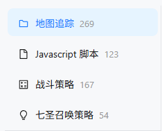
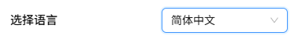

::: tip 提示

脚本仓库的更新时间为每天的北京时间18:30，偶尔会在其他时间更新，具体以仓库页面左下角时间显示为准

:::

## 本地版仓库

首次使用必须在脚本仓库的弹出界面上更新一次仓库。

如果 "Git一键更新" 失败，请尝试 "手动导入"。

手动导入的下载地址列表：

- 实时最新的仓库： [https://r2-script.bettergi.com/github_mirror/main.zip](https://r2-script.bettergi.com/github_mirror/main.zip)
- 蓝奏云（不是最新的）： [https://wwmy.lanzouq.com/b0fprlncj](https://wwmy.lanzouq.com/b0fprlncj)  密码:hfy6

## 在线版仓库

地址：[https://bgi.sh/](https://bgi.sh/)  
备用地址：[https://s.bettergi.com/](https://s.bettergi.com/)

::: warning 注意

在使用在线仓库订阅脚本时，请确保你的本地仓库已更新为最新版，即左下角的最近更新时间与本地仓库一致。  
在线仓库仅是一个页面，显示的是来自云端仓库中的最新数据，当你订阅脚本时，仅仅是复制了该脚本的文件路径，
由BetterGI在本地已经下载的脚本仓库中复制对应的脚本文件至你的[User](/feats/append/files.html)文件夹下。因此，使用时确保本地仓库为最新版**至关重要**！

:::

## 使用教程

> 此处使用`本地仓库`浅色模式进行演示，部分仅在线仓库独有的功能将会标识。

### 1. 打开仓库

#### 1.1 获取仓库

在每次打开仓库前，请确保你在如下窗口中，点击了`更新仓库`，并耐心等待更新完成（在进度条未消失前就关闭这个窗口或进入仓库可能会**触发一些报错**）。  
> 请注意！这里的更新仓库仅仅更新你本地中央仓库的信息，并不会自动更新已经订阅的脚本或路径！这是一个新手经常会弄错的概念！  
> 你也可以通过查看[本地文件](/feats/append/files.html)中的Repos的说明了解更多。

#### 1.2 打开页面

如果你成功打开了`本地/在线仓库`，那你应该能够看到如下所示的完整页面（部分功能仅`本地仓库`可用）。

#### 1.3 打开失败

当你打开`在线仓库`页面时，若出现以下弹窗，属正常现象，点击`刷新页面`重试即可，若有疑问可点击`查看帮助`解决。

### 2. 选择目录

当你成功打开页面后，可以点击左侧的目录选择你想要订阅的脚本。

不同目录对应的脚本内容如下：
* 地图追踪：仅根据作者录制的路径进行移动，根据你设置的参数进行换队、战斗、拾取等。
* Javascript脚本：由不同作者编写的各式各样的基于BGI的脚本，花样繁多，功能性远大于`地图追踪`。
* 战斗策略：在运行`地图追踪`路径时遇到打怪点位时执行的角色战斗逻辑。
* 七圣召唤策略：根据不同角色或关卡执行的七圣召唤打牌策略。

> 目录是可以拖动的，除`地图追踪`外，其它列表的宽度被拖到足够宽时会使用两列展示信息哦

### 3. 选择脚本

选择对应的目录后，目录右侧区域会显示对应目录下的脚本列表。你可以对列表进行搜索或筛选,本地模式下会提供`有更新`与是否`已订阅`提示。

你可以在搜索框中输入`脚本名称`、`作者名称`、`脚本简介`、`tag`相关信息以进行搜索，目前仅支持关键字搜索（即输入错别字与近义词无法被搜索到）。
你也可以使用搜索框上方与右侧的按钮进行筛选与排序。

> 排序功能因`地图追踪`的列表结构特殊性无法使用  
> `角色筛选`功能仅在战斗策略目录下可用

### 4. 订阅脚本

当你选择了一个脚本后，你可以点击`订阅`按钮以进行订阅。在本体中跳出如下界面后点击`确认导入`即可。
> 在线模式下请在点击订阅后手动回到`BGI`以继续

### 5. 地图追踪详情

#### 5.1 README

无论是`本地仓库`还是`在线仓库`，在你选择或订阅树状结构中的脚本后，都会尝试加载该脚本所在节点的`README`文件并渲染（若直接滚动至文件列表则表示无`README`文件）。请仔细阅读对应`README`内容，脚本配置与运行时的注意点都在其中，根据其中内容操作能够减少发生问题的概率，减轻作者们的解答负担。
> 若因为没有阅读`README`内容而在询问作者或其他人时没有被理睬，请保持理智，优先回去阅读`README`

#### 5.2 文件列表

在文件列表选项下，你可以查看当前选中节点下的脚本文件（也称路径文件）表格。你可以在表格中`筛选`或`排序`，也可以对已订阅的脚本中的具体文件进行`再次订阅`（`更新`）。
> 将鼠标移至对应条目的`名称`时，若该条目包含作者编写的简介或描述信息，会以气泡形式悬浮在名称附近供你查看

#### 5.3 文件详情

点击对应条目的`详情`按钮后，会出现以下弹窗，你可以查看该项的具体信息。

### 6. JavaScript脚本详情

同`地图追踪`，JS脚本也会在你点击后展示该脚本的`简介`与`README`内容。

> 若空白一片，则表示该脚本既没简介又没`README`文件  
> js脚本请尽可能阅读`README`，不同于`地图追踪`，脚本中作者需要你设置的内容会更多更频繁

### 7. 战斗/七圣召唤策略详情

`战斗策略`与`七圣召唤策略`目录下的策略详情将直接展示`简介`与文件内容本身，而不展示`README`，你可以直观看到策略会如何执行。  

> 一部分作者会把策略使用说明一同写在策略文件中，阅读后食用更佳哦。

### 8. 工具栏与其它功能

在界面的右侧区域，你会发现一些上文没有提到的按钮，下面将介绍这些按钮的功能。

#### 8.1 最近更新

**仅`本地仓库`可用**  
点击此按钮，你可以查看历史中有更新且未被点击过的脚本，也能清空`有更新`标记。
> 此处仅展示对应脚本的部分信息，详情请自行前往对应脚本详情下查看

#### 8.2 一键更新

**仅`本地仓库`可用**  
点击此按钮，你可以一键更新所有你已经订阅的脚本，放空大脑，一键式操作！
> 此处仅展示对应脚本的部分信息，详情请自行前往对应脚本详情下查看

#### 8.3 更新计划

为了促进与用户沟通，当点击此按钮后你会看到作者未来的开发计划，如果你想提的想法已在其中，就可以不用再麻烦地找到作者提意见啦。

#### 8.4 帮助

点击此按钮后，你会看到一些作者预想到用户会问的问题与对应的解答。
> 并不会太全面，如有需要补充可提出

#### 8.5 设置

此节内容请移步[9. 设置](#9-设置)查看。

#### 8.6 Github

点击此按钮，你会跳转到一个新的页面，这里是这个脚本在Github仓库（也是脚本仓库的中央仓库）中的具体位置。
> 普通用户平时用不到，一般供开发者查阅具体内容  
> `Github`相关内容请自行使用浏览器搜索

#### 8.7 评论

点击此按钮，会跳出当前选中脚本的评论区，`本地仓库`页面会显示提示，请前往`在线仓库`页面继续使用。  
评论区功能基于`Giscus`插件实现，每个不同的脚本都是不同的评论区（`地图追踪`的每个可以看见的节点都是独立的评论区，进行评论前请注意你选择的节点是否正确哦）。在登录`Github`账号后，可以进行评论或留下小表情。  
> `Github`相关内容请自行使用浏览器搜索  
> 若修改了`主题色`或`语言`，评论区没有发生变化，可以通过刷新页面或关闭后重新打开解决

### 9. 设置

点击`设置`按钮后，会弹出`设置`弹窗，在这里你可以进行一些设置。

#### 9.1 选择语言

在这里你可以选择你想要的语言，但这仅对页面框架生效，对脚本内容并不能生效（因为脚本本身只有仓库中作者编写内容时使用的语言鸭）。  

当前支持的语言有：
* 简体中文
* 繁体中文
* 英语
* 日语
* 法语

#### 9.2 主题

在这里你可以选择你想要的主题色。  
未来会不定期更新更多的主题色，此部分可自行前往`更新计划`中查看，不过多赘述。  

#### 9.3 清除更新提示

**仅`本地仓库`可用**
与`最近更新`中的`清除更新提示`一致，可以一键消除所有本地的`有更新`提示。

### 10. 彩蛋

除了`主题`设置中的一个主题色小彩蛋外，页面中还有一个小彩蛋，在哪儿呢？快自己到处点点看找到它吧！

### 11. README特别说明

由于`README`的特殊性，此处额外对上文没有提到的内容进行一些补充说明：

1. `本地仓库`页面的`README`文件内容从本地文件中直接获取，加载较快
2. `在线仓库`页面的`README`文件从`Github`仓库通过网络获取，可能会出现超时
3. 在本页面的`README`渲染中，进行过一些特殊处理，也提供了个别额外功能，供开发者使用。在编写`README`时，可以在`markdown`语句中通过`iframe`引入你自己的`html`文件以达到内嵌的效果，但由于跨域限制，只能在`本地仓库`页面使用。使用时，请将`html`文件放置在你的资源目录中，通过`iframe`调用它。相信配合`iframe`你能进一步发挥`README`的功能性。

## 常见问题

#### ❓为什么我脚本仓库页面打开是空白的，也没有报错?
如果没有任何报错，只有白屏或黑屏，那极大概率是你的webview2需要更新（安装）了。请前往[webview2官网](https://developer.microsoft.com/zh-cn/microsoft-edge/webview2?ch=1&form=MA13LH#download)，点击第一个卡片中的download以下载。  
成功下载好更新程序后，请务必使用管理员方式运行，否则即使显示完成了也无法成功更新！

#### ❓更新仓库报错"The process cannot access the file 'pack_git2_xxxxxxx' because it is being used by another process."
更新仓库过程中请不要关闭界面，耐心等待进度完成，否则就可能会触发此类文件占用情况。遇到这种情况时，只需要关闭你的BGI，然后重新打开，更新仓库即可。

#### ❓更新仓库报错"failed to connect to github.com"
如果你不是一名魔法师，请不要选择github作为你的更新渠道，因为这不是国内平台，连接不稳定。  
但如果你是魔法师，此处禁用了代理，你一样是一位普通人，只能看运气喽~。