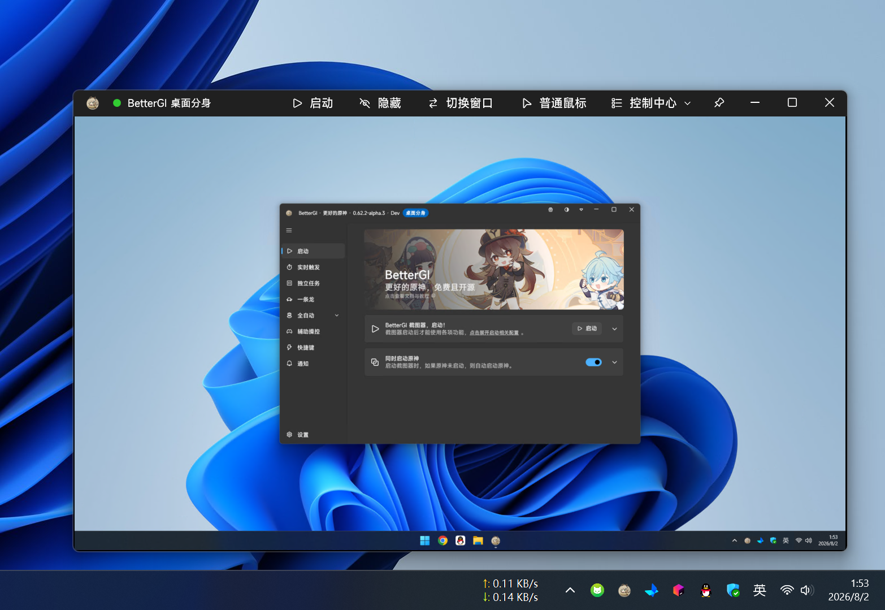
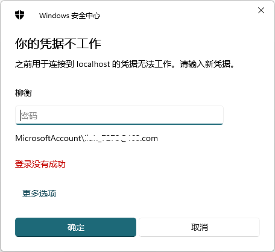
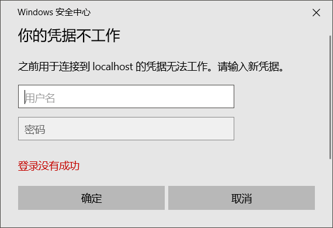
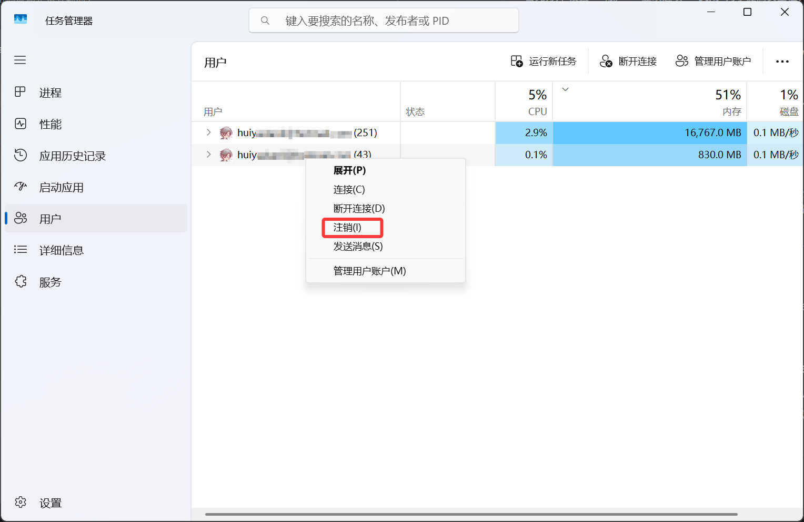

::: important
1. **该功能完全基于 Windows 的功能特性实现，无法使用、以及各类兼容性问题都和 Windows 本身相关，BetterGI 只是唤起了这个功能！**。
2. 如果你曾经使用过一些系统优化/瘦身软件，或者本身就是第三方精简系统，极有可能因为系统设置或者组件缺失的问题导致该功能不可用。
3. **已知存在多种无法正常启动桌面分身的原因基本都和 Windows 用户 与 RDP 相关设置有关。你可能需要手动修改相关 Windows 设置才能够正常使用桌面分身！**
4. 使用 **rdpwrap** 实现 [本地远程多用户后台挂机](/tutorial/rdp.html) 的，可能无法正常使用此功能。但是远程多用户功能更加强大且稳定，完全可以覆盖桌面分身的功能，你没有必要使用桌面分身功能。
:::

BetterGI 桌面分身会创建一个独立的 Windows 会话，并通过本机 RDP 将该会话的画面嵌入桌面分身窗口。通过这个方式桌面分身功能提供了一个**独立的桌面运行环境**，在桌面分身内启动的应用、游戏将不会出现鼠标的占用的问题。这个功能**理论上可以做到任意游戏的后台键鼠操作模拟**。

一个 Windows 下，最多启用一个桌面分身。

## 使用说明

1. 直接打开桌面分身功能并启动。**首次可能花费较久的时间初始化，如果报错可以重启软件再试一次。如果多次不行，可能和系统环境有关**
2. 首次会要求输入 Windows 登陆凭据，请输入你当前 Windows 登陆用户的用户名密码（什么你不知道？）。历次登陆可能会要求输入登陆凭据，也可能不需要，和 Windows 具体版本和设置有关。

3. 登陆成功后，等待一会，会有一个完整的桌面窗口出现，并且里面自动启动 BetterGI 。如果 BetterGI 没有启动，则在点击窗口右上角的 “控制中心” —— “启动 BetterGI”
4. 然后你就可以在 BetterGI 中正常启动原神并使用 BetterGI 的功能了，此时所有任务都不会影响原先桌面的操作了。
5. 如果你关闭桌面分身内的 BetterGI ，会导致桌面分身内的原神游戏内，鼠标相对移动无法正常处理。

### 环境要求

1. 仅支持在 Windows 8, Windows Server 2012 及更高版本的**非家庭版系统**中运行（部分家庭版系统可能能用）。BetterGI 本身要求 Windows 10 及以上系统。
2. 系统的UAC、RDP、多用户等模块没有经过其他软件魔改/精简/优化。
3. 没有乱七八糟的安全软件。暂未测试是否会造成什么负面影响，或者直接拦截。

### 注意

1. 启动桌面分身时，部分开机启动项也会重新启动。可能会冲突报错。
2. 部分软件不支持这个场景，无法同时在两个桌面中运行。比如 Chrome 浏览器等。
3. 原神只能启动一个。想要处理多开需要使用其他方式。
4. **桌面分身启动状态下，无法重启或关机**，需要提前关闭桌面分身。（正常关闭 BetterGI 会自动关闭桌面分身，BetterGI 崩溃情况下可能出现这个场景）。可以在 任务管理器 —— 用户 —— 右键注销同名用户即可关闭。
5. UU远程不支持多用户，所以桌面分身启动的情况下，UU远程可能会远程到桌面分身中的桌面。
6. 桌面分身内 不支持"以管理员权限运行"（首次启动的时候可能可以）。如果你需要以管理员权限启动软件，请使用 BetterGI 桌面分身窗口右上角的 “控制中心” —— “更多” —— “以管理员启动” 功能。

### 功能

1. RDP 本身无法发送鼠标相对移动的信息。开启游戏鼠标功能后，桌面分身中原神激活的时候，BetterGI 会自动切换为游戏鼠标模式，**自动把鼠标锁定在桌面分身窗口中，按住 <kbd>Alt</kbd> 可以唤出鼠标**。
2. BetterGI 桌面分身窗口右上角的 “控制中心” —— “更多” —— “以管理员启动” 功能，可以以管理员权限在桌面分身中启动软件。直接在桌面分身内使用右键——以管理员权限运行会失败（首次运行可能会成功）。
3. 更多功能点请查看  [桌面分身界面按钮说明](/feats/autos/command/session-window.html)

## FAQ

更多桌面分身相关的内容可以在此查看： [桌面分身 Issues](https://github.com/babalae/better-genshin-impact/issues?q=label%3A%22%E6%A1%8C%E9%9D%A2%E5%88%86%E8%BA%AB%22)

由于这个功能是 Windows 提供的，很多相关问题都是来自于 Windows 设置与机制本身。欢迎在 Issue 中分享你遇到问题并解决的经验~

### 出现 516 RDP 连接已断开 错误

重启 BetterGI 后重试，如果还不行。请仔细阅读上面的使用说明。

### 能否在桌面分身中运行其他软件？

可以。但是部分软件由于设计原因可能无法同时在两个桌面中启动（比如 Chrome）

部分开机自启动的硬件驱动软件也会产生问题，比如一些副屏软件。

### 桌面分身首次弹出登录框密码怎么输入都不对怎么办？

使用开机密码、微软账户密码尝试都失败后。

首先打开 设置 → 账户 → 登录选项 → **关闭** "为了提高安全性，仅允许对此设备上的 Microsoft 帐户使用 Windows Hello 登录"。

然后再尝试下面两个方案：

1. 将当前用户转换为本地用户（随便搜索下就有方法，在 Windows 用户设置中）
2. 新建一个本地用户

（部分人必须要使用本地用户才能够正常登陆桌面分身，我个人是直接微软账户+密码能够正常登陆的）

（文档待补充）

### 每次都要输入密码怎么办？

1. 如果使用 PIN 登录 Windows 主会话，则您每次启动 桌面分身 会话时，系统都会要求您提供凭据。
2. 可以自行搜索 Windows 10/11 开机后用户不需要输入密码的方案。 
    * Microsoft 账户用户： 可通过 <kbd>win</kbd> + <kbd>r</kbd> 输入 netplwiz（或 control userpasswords2）开启 Windows 自动登录。取消勾选 "要使用本计算机，用户必须输入用户名和密码"，点击"应用"后保持默认用户名不变，仅输入 Microsoft 账户密码（不是 PIN），重启电脑即可。之后 桌面分身 将不再每次要求输入密码。

### 使用桌面分身后，无法关机、重启系统怎么办？

BetterGI 闪退，或者直接结束进程后，桌面分身未正常退出，会导致系统无法关机、重启。

只需要打开 “任务管理器”，在 “用户” 菜单中，选择进程数较少的同名用户，右键注销即可。

### 为什么原神游戏内的鼠标可以相对移动，其他游戏不行？

因为 RDP 本身不支持鼠标相对移动事件的发送。桌面分身内的 BetterGI 针对这块做了特殊处理，在原神处于前台的时候，会将主桌面的鼠标的相对移动数据转发到桌面分身内的 BetterGI 进行模拟移动（BetterGI 必须要处于启动状态）。如果你需要兼容其他游戏，请发起 [Issue](https://github.com/babalae/better-genshin-impact/issues)。
