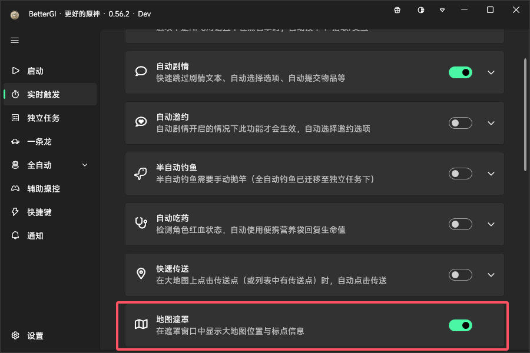
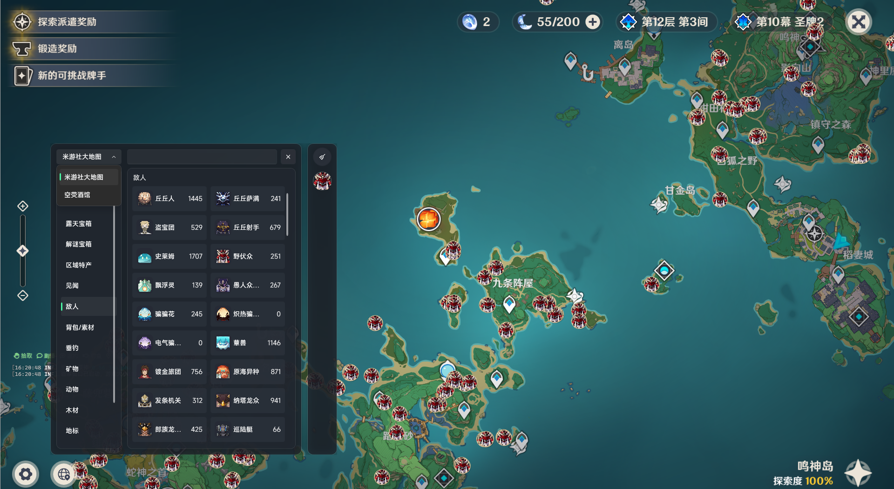
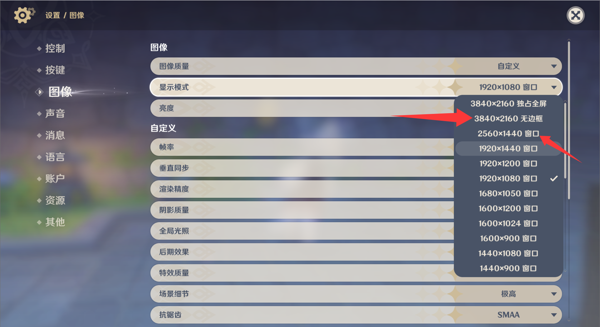

地图遮罩功能可以将米游社大地图或空荧酒馆的地图标点以遮罩的形式渲染到原神地图上

此功能默认开启，不经常使用的情况下可以在设置中关闭

## 打开地图

开启地图遮罩功能后，在游戏中打开地图，就可以在左下角看到一个经纬线图标，点击即可开始使用。

## 选择数据源

地图遮罩目前支持两种数据源，可以通过展开窗口左上方的下拉框进行选择，两种数据均为无登录状态下的最新官方点位

## 选择标点

勾选需要显示的标点后，标点会渲染到原神地图上，点击标点即可查看详细信息，点击上方的视频攻略会通过浏览器跳转至攻略视频。

## 常见问题

### ❓为什么我点击图标后退回到了桌面？

遇到这种情况，请在原神设置中将游戏显示模式切换为无边框或窗口化。

### ❓能否登录米游社或者空荧酒馆查看自己标记的点位？

登录行为是违规的，且每次打开都需要同步官方数据，暂不支持自定义点位哦。

### ❓能否支持小地图显示？

锐意开发中，适配小地图也需要时间，欢迎前来开发贡献~

### ❓图标位置有偏移？

仅推荐16：9的游戏显示比例下使用，否则产生偏移是正常现象。

### ❓遮罩图标进入其他页面后有残留？

已在0.56.3-alpha.1版本修复，于0.57正式版中统一推送，如在后续版本仍遇到此问题，请在github中发起相关issue。