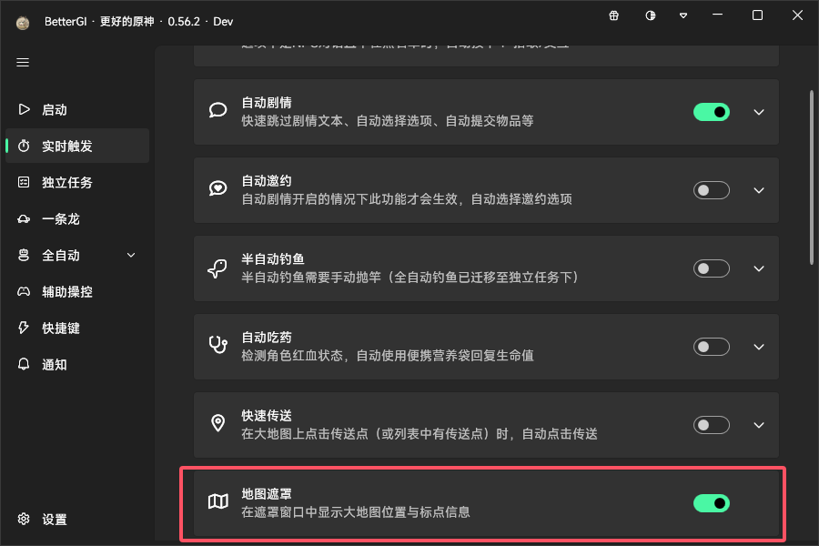
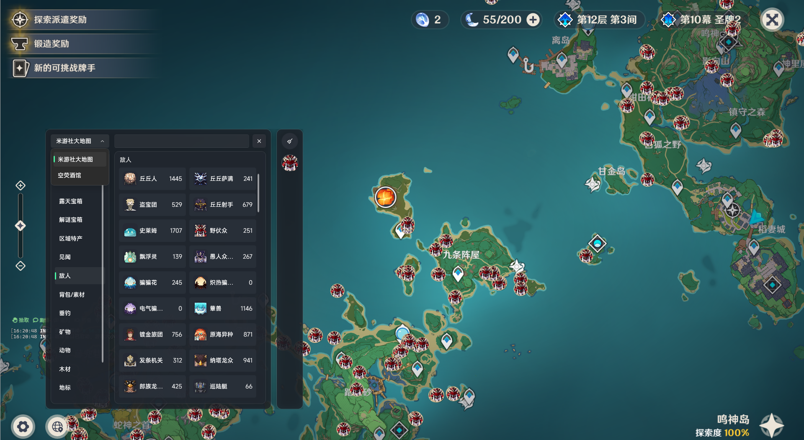
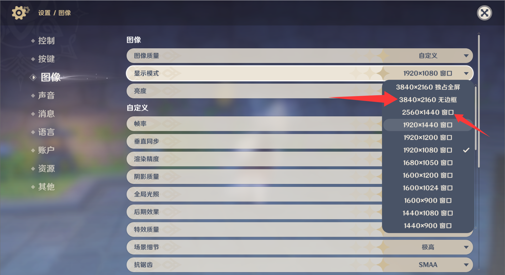

::: warning

理论上需要大于等于 `1920x1080` 的 `16:9` 分辨率，其他分辨率未测试，且可能存在图标位置偏移等问题。

只支持提瓦特大地图，不支持渊下宫等独立地图，不支持分层地图。（未来可能会开放）

小地图遮罩在无法正常匹配到地图内容时，会进行全局匹配，此时会对软件性能有所影响。

:::

地图遮罩功能可以将米游社大地图或空荧酒馆的地图标点以遮罩的形式渲染到原神地图上

此功能默认关闭（0.58之前版本默认开启），不经常使用的情况下可以在设置中关闭

开启此功能后，M键打开地图会切换为交互模式，此时日志框文字可能会遮挡鼠标与原神的交互。

## 打开地图

开启地图遮罩功能后，在游戏中打开地图，就可以在左下角看到一个经纬线图标，点击即可开始使用。

## 选择数据源

地图遮罩目前支持两种数据源，可以通过展开窗口左上方的下拉框进行选择，两种数据均为无登录状态下的最新官方点位

## 选择标点

勾选需要显示的标点后，标点会渲染到原神地图上，点击标点即可查看详细信息，点击上方的视频攻略会通过浏览器跳转至攻略视频。

## 小地图遮罩

开启后在选择了标点后，小地图上也会显示对应的标点，小地图遮罩无法做出任何交互。

开启小地图遮罩后，启动游戏时候就会出现特征点/模板加载提示。

## 常见问题

### ❓为什么我点击图标后退回到了桌面？

遇到这种情况，请在原神设置中将游戏显示模式切换为无边框或窗口化。

### ❓能否登录米游社或者空荧酒馆查看自己标记的点位？

登录行为是违规的，且每次打开都需要同步官方数据，暂不支持自定义点位哦。

### ❓图标位置有偏移？

仅推荐16：9的游戏显示比例下使用，否则产生偏移是正常现象。

### ❓遮罩图标进入其他页面后有残留？

已在0.56.3-alpha.1版本修复，于0.57正式版中统一推送，如在后续版本仍遇到此问题，请在github中发起相关issue。