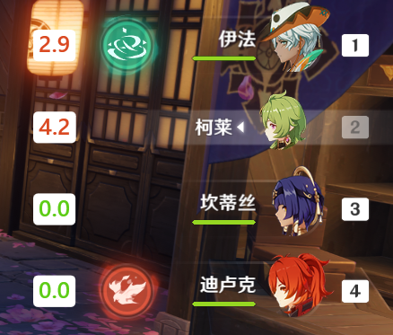
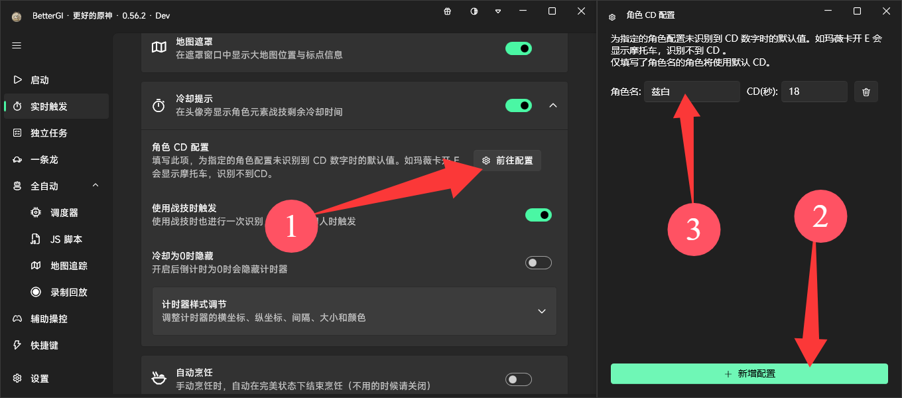
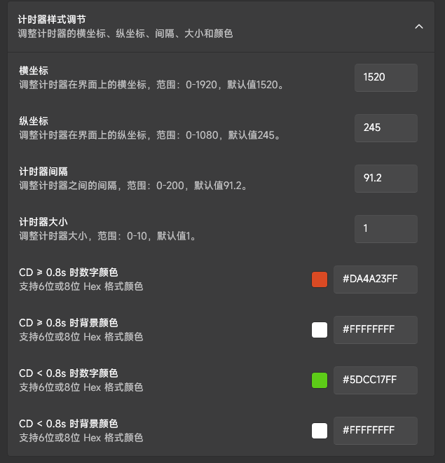

::: warning 分辨率

**仅支持 1、2、3、4 切人键位**

:::

开启后，角色的元素战技 CD 可以在切人或按下 E 时通过文字识别读取到，进而显示在角色头像附近。

此功能默认关闭，为避免影响正常游戏体验，建议仅在凹分情况下开启。

## 角色 CD 配置

有一些角色的技能较为特殊，可能为多段、动态变化或特殊状态，以下统一为一种情况：**无法识别数字**

### 特殊状态

如图，`兹白`在使用技能后会进入特殊状态，此时无论切人还是按 E 都无法识别到技能上的时间，那就可以到`角色 CD 配置`中配置这类角色的 CD。

设置后，在你按下E（需开启`使用战技时触发`）或按下 E 的1.1秒内切人时会使用你设置的 CD。

> 注意：切人前的1.1秒内未按下过 E 不会触发此设置，以上设置仅在数字识别失败时生效。

### 冷却减免

有些角色（如`仆人`）会改变自己或队友的 CD，此类情况不受影响，因为切人时会识别切人前的最后剩余 CD，达到类似“回正”的效果。

## 样式修改

部分用户可能因为分辨率不适配或个人喜好原因想要调整计时器的样式，可以在设置中自行修改。  
此处支持保留一位小数的坐标与间距调节，以及6位或8位（含透明度）的 Hex 格式颜色。  
如需回到默认设置，可以清空输入并重启软件。

## 常见问题

### ❓能否支持元素爆发？

元素爆发同时被 CD 与充能限制，且可以使用时本来就会显示图标，功能性上来说并没有战技有用，检测也更麻烦一些，暂不考虑支持。

### ❓我的 CD 识别有误

OCR技术对数字识别本身就不能做到百分百准确，遇到不准确请自行留意异常，几乎无法优化。

### ❓我的计时有几秒误差

考虑到可能会出现的异常情况，在队伍角色不变时，任何页面被打开都不会停止计时，以避免计时器异常清零。如需要开书吃球，请自行脑补对应时间。

### ❓计时突然清零/消失

战斗时偶尔会出现导致识别角色出错或识别到当前场景不在大世界与秘境中，此时计时器就会清零或消失，出现此情况为正常现象，无法修复。
