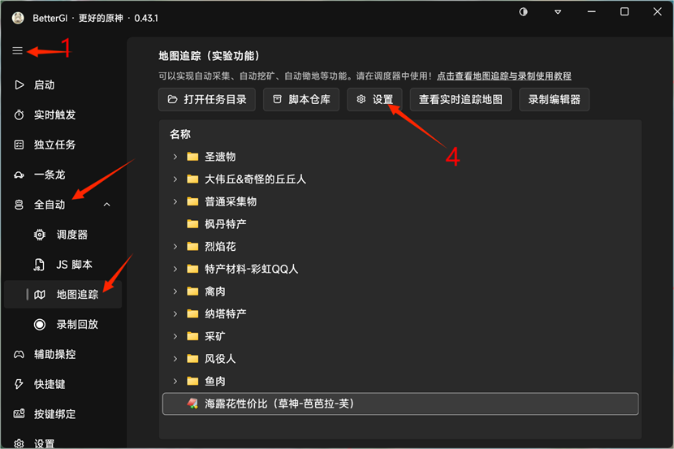
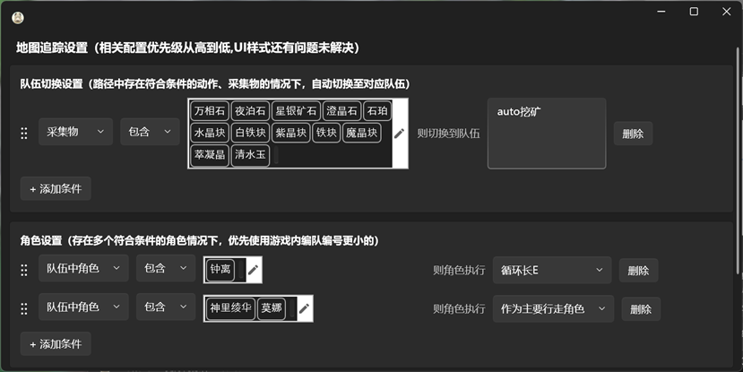
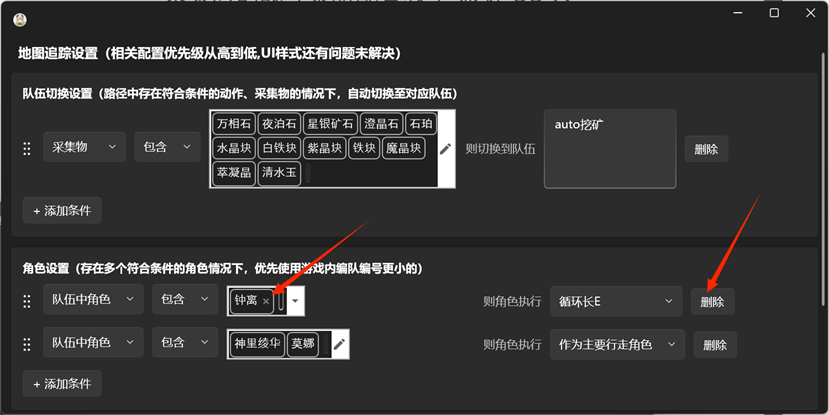

# 采集时的战斗策略配置教学-彩虹QQ人

 本教程适用于BGI在地图追踪中使用自定义的战斗策略。

前情提要：如果在你的脚本中（地图追踪脚本）需要用到的队伍角色（如芭芭拉、芙宁娜、钟离等）建议从自带的角色设置中分离出来（删除原有配置，在BGI的地图追踪页面的设置中），避免需要用到技能时候出现长时间空窗期导致采集点跳过。如:
采集海露花时利用芭芭拉水环直接挂水采集。

## 一、删除原有配置的步骤

 1、打开BetterGI 进入地图追踪页面（主页面-全自动-地图追踪）如果不是这样的，请点击1号红色箭头所指图标。

 2、点击上图中4号红色箭头所指的“设置”，如下图所示。

 3、找到角色设置卡片栏中的所需删除的角色配置，点击一下对应角色会选中他（框框内多出一个小叉叉×）点击叉叉×即可删除，或者同一栏最右侧的删除按钮也可删除。删除完成之后，点击右上角的叉叉×退出即可。

## 二、自定义战斗策略的教程

 以下是在地图路径点编辑器中使用自定义战斗策略的教程。

### 1.将该点动作设置成战斗策略

 选中该点-动作下拉窗口-选择“执行战斗策略”。

### 2.在添加战斗策略

 在战斗策略管理中，增加所需要的战斗策略，点击“战斗策略管理”跳转到图6。

 点击“添加”。

在“策略参数”一栏中填写所需的战斗策略，具体策略编辑请参照：[自动秘境 | BetterGI·更好的原神](https://bettergi.com/feats/task/domain.html#战斗策略脚本编写)

### 3.使用自定义战斗策略

 添加完成战斗策略之后，在“执行战斗策略”选项中，会有输入框和下拉框，可以选择在此处重新输入特殊的战斗策略，也可以选择一些自定义的通用战斗策略。

 建议：在“添加战斗策略中”的操作中，录入通用的一些战斗策略（如芙宁娜重击、万叶长E等）。一些特殊的战斗策略或是比较复杂、使用频率不高的，则建议在“执行战斗策略”下面的输入框中填写。

### 4.最终路线录制呈现

 以上就是在地图追踪功能中使用自定义的战斗策略教程，希望对正在看此教程的你有所帮助。

 最后，祝自己十连双金，单抽奇迹。
